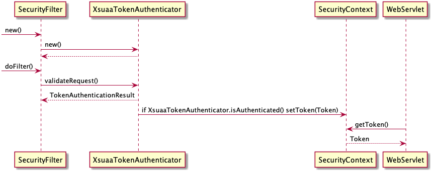

# SAP CP Java Security Library

A Java implementation of JSON Web Token (JWT) - [RFC 7519](https://tools.ietf.org/html/rfc7519). 

- Loads Identity Service Configuration from `VCAP_SERVICES` environment. The [`Environments`](src/main/java/com/sap/cloud/security/config/Environments.java) serves as central entry point to get or parse the  [`OAuth2ServiceConfiguration`](src/main/java/com/sap/cloud/security/config/OAuth2ServiceConfiguration.java) within SAP Cloud Platform.
- Decodes and parses encoded JSON Web Tokens ([`Token`](src/main/java/com/sap/cloud/security/token/Token.java)) and provides convenient access to token header parameters and claims.
- Validates the decoded token. The [`JwtValidatorBuilder`](src/main/java/com/sap/cloud/security/token/validation/validators/JwtValidatorBuilder.java) comprises the following mandatory checks:
  - Is the JWT used before the `exp` (expiration) time and eventually is it used after the `nbf` (not before) time ([`JwtTimestampValidator`](
 src/main/java/com/sap/cloud/security/token/validation/validators/JwtTimestampValidator.java))?
  - Is the JWT issued by a trust worthy identity service ([`JwtIssuerValidator`](
 src/main/java/com/sap/cloud/security/token/validation/validators/JwtIssuerValidator.java))? In case of XSUAA does the token key url (`jku` JWT header parameter) match the identity service domain?
  - Is the JWT intended for the OAuth2 client of this application? The `aud` (audience) claim identifies the recipients the JWT is issued for ([`XsuaaJwtAudienceValidator`](
 src/main/java/com/sap/cloud/security/token/validation/validators/XsuaaJwtAudienceValidator.java)).
  - Is the JWT signed with the public key of the trust-worthy identity service? With that it also makes sure that the payload and the header of the JWT is unchanged ([`JwtSignatureValidator`](
 src/main/java/com/sap/cloud/security/token/validation/validators/JwtSignatureValidator.java))?
- Provides thread-local cache ([`SecurityContext`](src/main/java/com/sap/cloud/security/token/SecurityContext.java)) to store the decoded and validated token.
- Furthermore, it provides an authenticator ([`TokenAuthenticator`](src/main/java/com/sap/cloud/security/servlet/TokenAuthenticator.java)) that validates bearer tokens contained in the authorization header of HTTP requests. The authenticator is used in the following [sample](/samples/java-security-usage).


## Open Source libs used
- JSON Parser Reference implementation: [json.org](https://github.com/stleary/JSON-java)
- No crypto library. Leverages Public Key Infrastructure (PKI) provided by Java Security Framework to verify digital signatures.

## Supported Environments
- Cloud Foundry
- Planned: Kubernetes

## Supported Identity Services
- XSUAA
- Planned: IAS

## Supported Algorithms

| JWS | Algorithm | Description |
| :-------------: | :-------------: | :----- |
| RS256 | RSA256 | RSASSA-PKCS1-v1_5 with SHA-256 |


## Configuration

### Maven Dependencies
```xml
<dependency>
    <groupId>com.sap.cloud.security</groupId>
    <artifactId>java-security</artifactId>
    <version>2.4.4</version>
</dependency>
<dependency>
    <groupId>org.apache.httpcomponents</groupId>
    <artifactId>httpclient</artifactId>
</dependency>
```

## Basic Usage

### Setup Step 1: Load the Service Configuration(s)
```java
OAuth2ServiceConfiguration serviceConfig = Environments.getCurrent().getXsuaaConfiguration();
```
> Note: By default `Environments` auto-detects the environment: Cloud Foundry or Kubernetes.


### Setup Step 2: Setup Validators
Now configure the `JwtValidatorBuilder` once with the service configuration from the previous step.
```java
CombiningValidator<Token> validators = JwtValidatorBuilder.getInstance(serviceConfig).build();
```


> Note: By default `JwtValidatorBuilder` builds a `CombiningValidator`. 
> For the Signature validation it needs to fetch the Json Web Token Keys (jwks) from the OAuth server. In case the token does not provide a `jku` header parameter it also requests the Open-ID Provider Configuration from the OAuth Server to determine the `jwks_uri`. The used Apache Rest client can be customized via the `JwtValidatorBuilder` builder.

#### [Optional] Step 2.1: Add Validation Listeners for Audit Log
Optionally, you can add a validation listener to the validator to be able to get called back whenever a token is validated. Here you may want to emit logs to the audit log service.

```java
JwtValidatorBuilder.getInstance(serviceConfig).withValidatorListener(validationListener);
```

The validation listener needs to implement the [ValidationListener](src/main/java/com/sap/cloud/security/token/validation/ValidationListener.java) interface to be able to receive callbacks on validation success or failure.

### Create a Token Object 
This decodes an encoded JSON Web Token (JWT) and parses its json header and payload. The `Token` interface provides a simple access to its JWT header parameters and its claims. You can find the claim constants in the ([`TokenClaims`](src/main/java/com/sap/cloud/security/token/TokenClaims.java)) class.

```java
String authorizationHeader = "Bearer eyJhbGciOiJGUzI1NiJ2.eyJhh...";
Token token = new XsuaaToken(authorizationHeader);
```

### Validate Token to check Authentication

```java
ValidationResult result = validators.validate(token);

if(result.isErroneous()) {
   logger.warn("User is not authenticated: " + result.getErrorDescription());
}
```

### Cache validated Token (thread-locally)
```java
SecurityContext.setToken(token);
```

### Get information from Token
```java
Token token = SecurityContext.getToken();

String email = token.getClaimAsString(TokenClaims.EMAIL);
List<String> scopes = token.getClaimAsStringList(TokenClaims.XSUAA.SCOPES);
java.security.Principal principal = token.getPrincipal();
Instant expiredAt = token.getExpiration();
...
```

### Get further information from `VCAP_SERVICES`
In case you need further details from `VCAP_SERVICES` system environment variable, which are not exposed by `OAuth2ServiceConfiguration` interface you can use the `DefaultJsonObject` class for Json parsing. 

Example:
```java
String vcapServices = System.getenv(CFConstants.VCAP_SERVICES);
JsonObject serviceJsonObject = new DefaultJsonObject(vcapServices).getJsonObjects(Service.XSUAA.getCFName()).get(0);
Map<String, String> xsuaaConfigMap = serviceJsonObject.getKeyValueMap();
Map<String, String> credentialsMap = serviceJsonObject.getJsonObject(CFConstants.CREDENTIALS).getKeyValueMap();
```

## Token based authentication
The servlet authenticator part of this library makes it easy to integrate token based authentication into your java application.
For the integration of different Identity Services the [`TokenAuthenticator`](src/main/java/com/sap/cloud/security/servlet/TokenAuthenticator.java) interface was created. Right now there are these implementations:
- [XsuaaTokenAuthenticator](src/main/java/com/sap/cloud/security/servlet/XsuaaTokenAuthenticator.java)

> Depending on the application's needs the `TokenAuthenticator` can be customized.



The authenticator is used in the following [sample](/samples/java-security-usage).

## Test Utilities
You can find the test utilities documented [here](/java-security-test).

## Specs und References
1. [JSON Web Token](https://tools.ietf.org/html/rfc7519)
2. [OpenID Connect Core 1.0 incorporating errata set 1](https://openid.net/specs/openid-connect-core-1_0.html)
3. [OpenID Connect Core 1.0 incorporating errata set 1 - ID Token Validation](https://openid.net/specs/openid-connect-core-1_0.html#IDTokenValidation)
